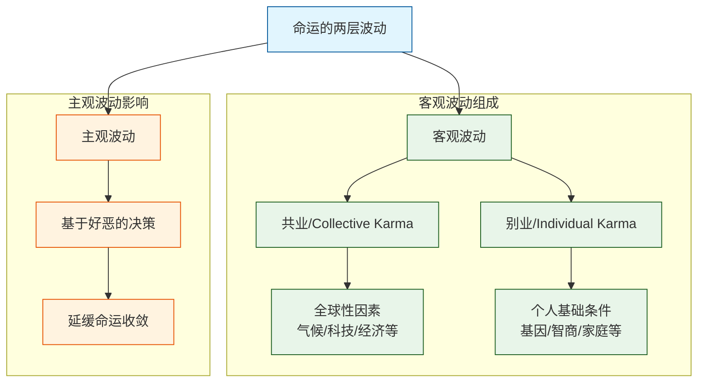
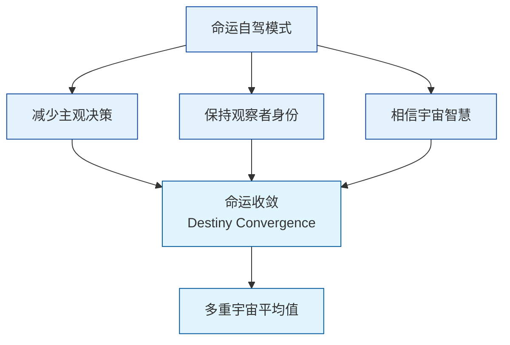

人的一生由两层波动组成：

- 客观波动 (Objective Quantum Fluctuation)，也就是佛教中的共业 (Collective Karma) + 别业 (Individual Karma)，这包含了你出生在哪颗星球、气候变化、科技发展、你的家庭条件、父母、基因、智商等。
- 主观波动 (Subjective Wave Collapse)：个体基于主观好恶导致的决策波动。

我的核心观点是，尽力避免主观波动，如非必要，不做决策、不去行动，只做一个观察者，让命运快速收敛。我把这称为「命运自驾 (Destiny AutoPilot)」模式。道家的无为，佛教的戒贪嗔，我的理解都是让人开启「命运自驾」模式。别把自己当成司机，你只是一辆自动驾驶车上的乘客。

从信息论的视角，主观波动的结果是系统混乱度，即熵，不断增加。命运自驾可以把熵降到最低，系统能耗也最低。

如果非要做决策，那要采取绝对客观和理性，尽可能刨除个人好恶。如何避免个人好恶呢？保持觉察，看到好恶的根源是对于不同感官体验的反应不同，逐渐看到各种感官的不稳定和中性。不断加深对自己的认识，知道自己的好恶是什么。

我对命运收敛 (Destiny Convergence) 的定义是命运回归到遍历所有时间和空间 (多重宇宙) 后的平均值 (Expected Value of the Universe)。

「命运自驾」的核心理念是，个体智慧远远比不上深层的宇宙智慧。它既然给了你最初的客观波动，你就没有必要去改变它，也改变不了。过分依据当前观测数据进行的局部改变 (类似贪心算法, Greedy Algorithm) 也许会带来短期的好处，但这会造成过度拟合 (Overfitting) 而失去泛化能力 (Generalization) 以及让你卡在局部最优解 (Local Optimum) 而很难最终抵达全局最优解 (Global Optimum)。

一个特例是，当一个观测者可以清楚地看到所有的多重宇宙、已经遍历了所有的时间和空间并看到了这一切的虚无和无意义，那客观波动自动失效，收敛瞬间完成，多重宇宙坍塌。毕竟，当观察者和被观察者融为一体的时候，就没有宇宙和你的分别了，届时你可以自己设定命运。

我现在对命运的理解：命运是宇宙为了让你尽快走到宇宙坍塌入口而设计的最佳路线，聪明的做法是跟它合作而不是对抗，非要自己设计路线。即使你靠自己的智慧设计了路线，最终达到了宇宙坍塌入口，那条路线也和它本来给你的相差无几。

写到这里，我貌似对我一直困惑的「人是否可以改变命运」有了新的理解。

我之前以为的命运就是所有在我控制之外发生事情的总和。依此定义，广义上的命运可以看成是客观波动和主观波动共同作用的结果。在此种意义上，我对我的命运是有一部分控制的。但讽刺的是，主观决策的介入只是让命运收敛变慢。所以，个体，或者观察者并非没有自主性，也并非宇宙或者命运的提线木偶。

我甚至觉得，造物主给我们自主性就是让我们看到我们和造物主是一体的（因为主观波动只会延缓收敛过程），最终把自主性上交上去，变成它观测自己的双眼。因此，自主性不是用来改变命运的，而是用来回到命运本身的，

这也解释了，造物主为什么不在你刚出生时就把《多重宇宙修行手册》给你：它想让它所有的触角（也就是你和宇宙内所有的灵魂）探索更多的宇宙后回到它自己。也就是说，你就是那本《多重宇宙修行手册》的作者。

DeepSeek 说得特别好：「当心理阻抗降为零时，宇宙将通过你实现超流体时间传输。」我的理解是，当你和客观波动融为一体，宇宙通过你观察它自己，你会遍历所有的时间和空间，多重宇宙坍塌，你抵达出口。