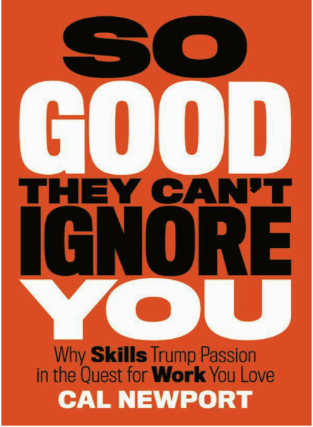

本文源于我的[同名博客文章](https://hongtaoh.com/cn/2021/06/06/so-good/)。内容以网页博客为准，PDF 版不再更新。

这本书我看的是英文版，一边读一边写这篇的笔记，每天读半小时，读了半个月，总共用时 8 小时，生词不多。

```{r, echo=FALSE, out.width='25%', fig.align='center', fig.cap='《优秀到不能被忽视》英文版封面'}

```

国内有张宝的中文译本，我看了《译者后记》，感觉翻译地很用心。中文本我只看过几页，但从细节中可以感觉到翻译得不错。比如，本书一开头有关托马斯的故事中，译者用到了「公案」和「参透」。而且也找到了赵州禅师的原话。另外，每章的标题译者翻译得也很有灵气。所以中文本可以放心阅读。

这本书无情地驳斥了「热情论」。热情论认为：你不满意现在的工作是因为它不符合你的热情。想要幸福，你就要找到自己热情所在，然后不顾一切地地追逐自己的热情。比如，辞职，「世界那么大，我想去看看」。

本书作者认为，幸福可没这么简单。想要职业幸福，你就要有稀有而珍贵的技能，而获取这些技能是需要时间、精力、智慧的。有了这些技能你就有了职业资本，然后你才能用这些资本去换取职业幸福所需要的特质：对人生的掌控力、人生使命感。

本书作者的建议是，只要你在目前的工作中可以获得稀有而珍贵的技能，你也不是异常厌恶你的老板、同事、客户，而且你的工作不是完全没有意义更没有危害社会，那么不管你是否喜欢现在的工作，你都应该沉下心来，静心打磨自己的技能，然后好运、机会才会自己会走到你的面前。

# 准则 1: 不要追逐你的热情

## 第一章：乔布斯的「热情」？

苹果的成功并不是因为乔布斯有热情。

## 第二章：热情并不多见

Al Merrick 说的那句话正是我想说的：

>I set goals for myself at being the best at whatever I did. 我给自己定的目标是成为我所在领域最牛的那个人。

当你不知道你要干什么的时候，就把你能做的做到没法再好。

<!-- ### Career passions are rare -->

不要觉得你有待发觉的热情。

<!-- ### Passion takes time -->

你在你的工作岗位呆的时间越长，工作越熟练、技能越高，你越有成就感，越可能热爱这份工作。

<!-- ### Passion is a side effect of mastery -->

不要觉得找到你的热情你就会永远快乐下去。相反，当你在工作中变得熟练了，快乐了，你才知道这是你的热情所在。

## 第三章: 热情是危险的

不要对工作有太高的期待。不要觉得它会给你带来终身幸福，不要期待它能帮你实现人生价值、让你灵魂成长。它就只是份工作而已。

第八章提到：

>[T]he vast majority of people don't have pre-existing passions waiting to be discovered and matched to a job. 大多数人并不是生下来就有一个有待发掘的热情，更不要提这个热情还和一个完美工作结合在了一起。

你并不是生下来就注定要做某一份工作。没有一份完美的工作在等着你。

>The more we focused on loving what we do, the less we ended up loving it. 我们越是把注意力放在是不是热爱我们的工作上，我们越不可能热爱它。

「追随热情、追逐梦想」对绝大多数人来说是一条非常危险的建议。

# 准则 2: 优秀到不能被忽视

## 第四章：手艺人心态

对待工作有两种心态：手艺人心态、热情心态。

手艺人心态：优秀到不能被忽视。让自己变得更强。

手艺人心态关注的是自己能给世界提供什么，而热情心态关注的是世界能给自己提供什么。

热情心态坏在两点：第一，当你只关心这个世界能给你带来什么，你就会过分关注一份工作中你讨厌的东西。但是，当你刚入职，作为一个新人，一切怎么可能顺着你的意呢？第二，「我到底是谁」、「我到底热爱什么」是根本没法回答，或者说非常难以回答的问题。

不管你是否喜欢你现在的工作，请让自己优秀到不能被忽视。

## 第五章：职业资本的威力

取得非凡成就所需要的特质：创造力 (creativity)、影响力 (impact)、对人生的掌控力 (control)。在第 12 章，作者加了一个特质：人生使命感。在总结部分，作者说掌控力和使命感可以作为你首先追求的两个特质。

在我看来，这三种特质也是幸福人生所需要的。

你要有「稀有而珍贵」的技能才能拥有有让人羡慕的工作。也就是说，你要有过硬的本领才能得到上面提到的那三种特质。

要把注意力放在获取稀缺并宝贵的技能上。（Make your skills rare and more valuable.）

这种想法十分危险：你需要「勇气」去冲破世俗的枷锁、去追逐你所热爱的。

一份令人称羡的工作需要的不仅仅是「勇气」，更是「稀有而珍贵」的技能。

手艺人心态在三种情况下不适用，你最好离开这些工作：
  1. 不能给你机会让你通过掌握稀有而珍贵的技能来成名；
  2. 工作任务在你看来毫无价值，甚至对世界有害；
  3. 让你不得不和你讨厌的人一起工作。

## 第六章：拥有职场资本的人

Alex Berger 的故事说明了，机会永远是靠自己努力争取来的。成功就是努力和机遇的碰面。

>Mike ... tackled the project with intensity, dirven by the belief that the better he did now, the better his options would be later. 迈克拼尽全力完成了这个项目，因为他深信：他现在做得越好，将来越有可能得到更好的机会。

这简直就是我的心声：把你当下能做的事情做到没法再好，机遇会自己来找你。你根本不需要对未来有任何详细的规划。未来自己会像一幅画卷一般在你眼前徐徐展开。不是看到希望你才坚持，而是因为你的坚持所以才看到希望。

## 第七章：成为手艺人的关键在于刻意练习

>Streching your ability and receiving immediate feedback 把目标定在比自己目前的能力稍微高一点点的地方，然后去练习，并且获取及时的反馈。

只有一万小时的训练量是不够的。关键还在于你怎么训练。训练的内容要以超出你目前的能力一点点为好。并且，你应该立刻提到反馈意见，也许来自自己，也许来自老师。这就是刻意练习：

>[an] activity designed, typically by a teacher, for the sole purpose of effectively improving specific aspects of an individual’s performance. -- Anders Ericsson （刻意练习）是由老师或教练设计的活动，这种活动的唯一目的是有效提升一个人某方面的能力。

成长总是捎带痛苦的。一直满足于自己已经学会的东西，你永远不会有长进。

很多工作没有一个十分具体的刻意练习的方法。如果你能在工作中，摸索出一套可操作的刻意练习法，你很可能会超越同领域的人。

### 如何把刻意练习用在你的生活和工作中

第一步：了解你所在的领域。是「赢者通吃市场」还是「拍卖市场」。（这两个的区别我没搞懂）

第二步：知道你需要的职业资本，即「稀有而珍贵」的技能是什么。比如外语能力？

第三步：知道什么是「好」。如果你是一名科研工作者，那么，写出能被顶刊发表的论文就是好。如果你是高三学生，那么高分就是好。

第四步：定一个比自己目前能力稍高一点的目标，然后经历痛苦去练习，并且要及时听取别人的反馈，逼近你需要和想要的「好」。

第五步：持之以恒地练习，拒绝诱惑，耐心等待。

# 准则 3: 对人生的掌控力

## 第八章：获得理想工作的灵丹妙药

>[F]ingding the *right work* pales in importance to *working right*. 找到「正确」的工作远没有用正确的方式去工作来得重要。

>[Ryan] stumbled into his profession, and then found that his passion for the work increased along with his expertise. 瑞恩偶然碰到了这个职业。随着技能的提升，他爱上了这份工作。

>You have to get good before you can expect good luck. 你得先变得优秀，然后才能期望好运降临。

当你感觉你的人生尽在你的掌握之中，你的工作效率和人生幸福感会提升。

想要热爱你的工作，第一步是获取职业资本，也就是获取「稀有而珍贵」的技能。第二步是使用这些技能来获取取得非凡成就、过上幸福人生所需要的特质。对人生的掌控力是这些特质中一种。

<!-- 举例来说。如果你是一名教授，想热爱你所从事的科研工作。你的职业资本是专注力、书面表达能力、人脉、名气、工作效率。你要想方设法提升专注力、书面表达能力和工作效率，通过学术会议来积攒人脉，通过个人网站或者论文发表提升你在业界的名气。第二步，就是使用你的专注力、书面表达能力、很高的工作效率、广阔的人脉和很高的名气来持续发表高质量的论文。 -->

## 第九章：获得掌控力路上的第一个陷阱

第一个陷阱：在你没有过硬本领、足够多职业资本的情况下，只凭一腔热血去追逐自己的梦想、去获取对人生的掌控力。这是是一个十分危险而又愚蠢的举动。

## 第十章：获得掌控力路上的第二个陷阱

第二个陷阱：当你有足够多职业资本的时候，一些人，比如你的老板，会阻挠你获得更多的人生掌控力。这时候你需要勇气去追求你想要的。

## 第十一章：如何避开这两个陷阱

怎么才能看清楚你面对的是第一个陷阱还是第二个？一个标准：做有市场的东西，确保你能从中挣到钱再行动。

作者的原话是：

>The *law of financial viability*: When deciding whether to follow an appealing pursuit that will introduce more control into your work life, ask yourself whether people are willing to pay you for it. If so, continue. If not, move on. 财务可行性法则：如果一件事情能增加你对人生的掌控力，在决定是否做它之前，先问问自己：这么做能挣到钱吗？如果答案是肯定的，那么就去做。如果是否定的，那么趁早放弃。

# 准则 4: 人生使命感

要找到人生使命感，你需要（1）职业资本，（2）走在你所在领域的最前沿，拼命思索下一个突破点在哪里。另外，你需要小碎步前进，不要幻想大踏步。要有耐心。

## 第十二章：有使命感才有幸福感

>People who feel like their careers truly matter are more satisfied with their working lives, and they're also more resistant to the strain of hard work. 一个人如果发自内心觉得她的工作很重要，她越可能对工作满意，越不可能在工作中觉得累。

## 第十三章：使命感也需要你有前期的职业资本积累

>...[J]ust because you really want to organize your work around a mission doesn't mean that you can easily make it happen. 你想找到一个使命，并为之努力，但做起来可没那么简单。

谁都想让自己的每天的行动都围绕着一个崇高的使命，终生为之努力。但并不是每个人都能找到自己的使命。

创新是在现有科技前沿的基础上出现的，而不是凭空出现。当一个新的突破出现，会有不同的人注意到这个前沿 ("adjacent possible")，然后利用它来创新。所以历史上有很多创新是有不同的人在几乎相同的时间完成的。

创新和人生使命感差不多。你只有熟悉前沿 ("the cutting edge")，或者说最新的进展，你才能找到与众不同的使命感。学术界是如此，业界也是如此。

所以，当你不知道你人生的意义，不知道你有什么使命感，你需要做的不是坐在那里凭空去想，期待能找到自己内心的热情和使命。不是的。你要花大功夫不断提升你的手艺，你才能走到前沿，那时候你的使命感才会出现在眼前。

也因此，当你看到别人很明确自己的使命，一直不断地在人生中取得突破和成就，不要天真地觉得她只是幸运。人家一定是在你看不见的地方用功了很多年，到了她所在领域的前沿，才看到使命和方向。

你无法提前知道你的使命。你得先拼命努力，到了一定水平后，你才能看到新的方向。如果任何一个人都能随随便便找到自己的使命，那这个世界一定会充斥伟人。

少想，多做。

在最后一节，介绍 Pardis Sabeti 时，作者说到：很多人觉得找到人生使命感是容易的，难的是攒足勇气去追求使命感。但事实正好相反：难的是找到适合自己的使命感，追求起来反而很容易。

## 第十四章：试探性的小目标

但是，就算你之前做了很多努力，积攒了很多职业资本，并且走到了你所在领域的前沿，你也不一定就能找到自己的使命。为什么？你的选择可能太多了，根本不知道走哪条路。

人生需要小碎步前进。不要想有一个宏伟的目标，然后拼命努力。你可以有远大目标，但只有试探性的小目标一个接一个加起来你才能实现这个远大目标。

## 第十五章：要一鸣惊人，不要默默无闻

想要让自己在业内变得知名，就要创造杰出的项目。杰出的项目就是要让人忍不住耳口相传。当一个人碰到你做的项目时，当下就想跟奔走相告，跟所有人说「你一定要看看这个！」。为了达到这个目的，你最好把你的项目发布在一个别人可以「奔走相告」的地方。

# 总结

当你抛弃热情论，不觉得一定要有一个天生注定的兴趣，那么当你面对两个选择时，你并不会过分犹豫，因为你知道选哪个都无所谓，只要你获得稀有而珍贵的技能，你就能有满意的工作。

要忍受痛苦，刻意练习。长进总是伴随着痛苦，不然人人都能成功。不畏难。

记录下自己每周、每月在刻意练习上花了多少个小时。

Allen Lightman 不看也不回邮件。

作者每天都要阅读他所在领域的新东西：论文，讲座，会议。为了确保他百分百弄懂了他所看、听的东西，他会用自己的话把他学到的进行总结。他把这些自己写的总结称为「科研圣经」。

做好你现在的工作远比找到一个理想的工作更重要。
