本文源于我的[同名博客文章](https://hongtaoh.com/cn/2021/09/11/driving-knowledge-wi/)。内容以网页博客为准，PDF 版不再更新。

以下考点主要来自 [driving-tests.org](https://lacrosselibrary.driving-tests.org/wisconsin/) 以及 [*Wisconsin Motorists’ Handbook (August 2021)*](https://wisconsindot.gov/Documents/dmv/shared/bds126-motorists-handbook.pdf)。

# 词汇表

- right of way: 路权
- tailgate: 紧随前车
- dig: 低洼地
- downgrade：下坡路
- pull up: 让车慢慢停下来
- pull over: 把车停在路边
- hydroplaning: 湿路滑胎
- traction: 附着摩擦力
- yield: 让行（如果有行人或者别的有路权的车辆，要减速或者停车）
- blowout: 爆胎
- acceleration lane: 加速车道，驶入高速路之前加速用的车道
- deceleration lane: 减速车道，驶离高速路时减速用的车道
- high/low beams 远/近光灯
- freeway: 全封闭、没有交通指示灯、没有停车路标、有绿化隔离带隔开双向车道的高速公路^[参考 https://posts.careerengine.us/p/5b121b134fb8460b67ea9be3]
- intersection: 道路交叉口

# 琐碎知识点

威斯康星的驾照有效期为 8 年。学车许可证 (instruction permit) 有效期为一年。

试用驾照 (probationary license)：路考通过后，从你的下一个生日算起，两年内你需要用试用驾照。试用驾照过期前 90 天之内你可以将其换成正是驾照。

闪烁的黄灯表示你要减速慢行，注意危险。

闪烁的红灯标示你要停下来，检查是否有来往车辆、行人，以及是否有危险，确认安全后你可以继续开动。

野鹿在黄昏和黎明时最活跃。野鹿一般成群出没，当你看到一只时，很可能后面还有。

急救车接近你时，在道路右侧找个地方停下来,救护车离开后你再开动。如果你在道路交叉口，记得离开。如果你在一个没有分隔的双向道 (undivided two-way roadway)，急救车和你不一个方向，你也需要在你的道路右侧停车。

威斯康星要求后座乘客也要系安全带。

四秒视距准则 (Four Second Sight Distance Rule): 口中默念 one-thousand-one, one-thousand-two, one-thousand-three, one-thousand-four。从开始到结束，你的车走的距离就是你能及时刹车的距离。晚上开车也可以用这个准则，确保车灯照亮的范围内你可以及时刹车。

开车打电话，出交通事故的概率翻四翻。

如果你还没进入在环岛 (roundabout) 碰到急救车 (emergency vehicle)，停车靠在路边，让急救车先行。如果已经进入环岛碰到急救车，不要立即停车，而是找到最近的出口，驶离环岛，然后停车，让急救车先行。

路缘 (curb) 涂成黄色，表示你只能停车载客、卸客、载物、卸物，不准多停留。

轮胎不平衡 (unbalanced tires) 或者轮胎低压 (low tire pressures) 会加速轮胎损坏、使车辆更耗油、让车辆更难转向或刹车。

假使你的行驶速度为x，刹车距离为 y，如果你的速度变成 $2x$，那么你的刹车距离为 $2^2 y$ = $4y$；同样，如果你的速度变成 $3x$，那么你的刹车距离变为 $2^2 y$ = $9y$。

多车道上，不要和别的车辆并行 (avoid driving alongside other vehicles)，因为并行会让很多车辆进入你所在的车道，导致堵塞。

想要避免紧急刹车，就要提前看前方是否有障碍物、杂物等

如果你前方是校车，请加大你们之间的距离

双向、多车道高速路，最右侧车道留给进入高速路的车辆、驶离高速路的车辆、慢行车辆。因此，大卡车一般都在最右侧车道，因为它们的行驶速度慢（不是因为它们有盲区）。

黑色字母、橘色背景：施工区 (work zone) 的标示。

Freeway 上的右侧车道要尽量留给驶离、驶入该 freeway 的车辆。

盲区在车的左后方和右后方（下图，右侧为前进方向），所以变道前除了看三个后视镜，还要回头越过肩膀看身后。

```{r, echo=FALSE, out.width='50%', fig.align='center', fig.cap="普通车盲区；图片出处：Wisconsin Motorists' Handbook"}
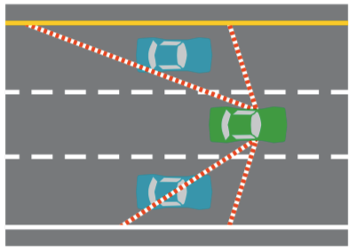
```

碰到慢行车辆，不要加速超车，而是要慢下来，注意安全。慢行车辆的司机也许会靠边停车以让你通过。

驾驶时，如果迎面过来一辆车辆，赶紧刹车、闪灯、鸣笛，把你的车往右开而不是左。迎面车辆的司机很可能困了，当他突然醒过来，也许会下意识往他的右侧（也就是你的左侧）停车，如果你也往左开，你们可能会相撞，这是致命的。

环岛上的车辆要逆时针行驶。

当你行驶到道路交叉口听到急救车的鸣笛，不要停在交叉口，而是要驶离交叉口，然后靠在路的右侧停车。

下坡时换到低档 (lower gear)。

Stopping distance = perception distance (眼睛看见障碍物到脑袋反应过来) + reaction distance (脑袋反应过来到踩刹车) + braking distance (踩下刹车到车停下来)

在学校附近 (school zone)，你必须减速到规定速度范围。

双向车道如果中间有个车道 (a two-way left-turn lane)，这个中间车道是专门给左转车辆用的，不是用来超车的。这种车道一般如下所示：

```{r, echo=FALSE, out.width='75%', fig.align='center', fig.cap="左转专用车道；图片出处：driving-tests.org"}
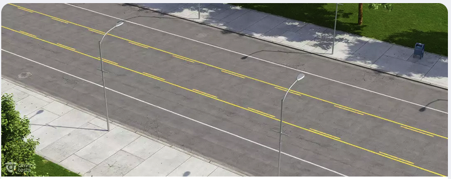
```

如果你在道路交叉口停车等红绿灯，但你后方有一辆车高速驶来，你应该把车往前挪一下，给这辆高速行驶的车多一些距离，好让它刹车。

学校附近和施工区，违章罚款是平常的双倍

红灯时右转也是允许的，但要注意：1）没有路标显示 “no turn on red” 2) 右转前你需要先停一下，大概2-3秒，看下是否有行人和来往车辆，确认安全之后再转。

如果你行驶的路边停着一辆警车或者救护车，你需要做的是尽量变道到另一条道路，如果无法变道，就减速慢行。

如果迎面朝你来的车靠近你时依然用的是远光灯，你可以闪几下你的远光灯提醒他变成近光灯，如果他没变，不要用用开你的远光灯来报复，而是减速慢行，靠右行驶，眼睛看你的右方。

如果出了事故，有人受伤，或有人死亡、或你自己或者别人的财产损失在 1000 美元以上，或者政府财产损失在 200 美元以上（政府车辆：如果损失在 1000 美元以上），你都需要向执法部门报告 (report a crash to a law enforcement agency)。如果它们不管，你必须在事故 10 天之内自己在网上报告。

如果你更换住址，需在 10 天内通知 DMV。

在威斯康星，必须 15周岁零六个月以上才能拿学车许可证 (instruction permit)。

在威斯康星，执法部门可能会通过检查呼吸、血液、尿液的方式来查看你体内的酒精含量。

在十字交叉口，你停车，打算右转，看见左侧路上有车也打灯准备右转。这时候你最好等他开始右转之后再开动，因为他可能会临时改变主意，不右转，而是直走，如果你不等他转就先转，你们很可能相撞。这就叫防守型驾驶  (defensive driving) 。

如果人行道上有盲人，要等他过完马路你才能开动。如果他虽然不在你所在的车道了，但仍然在人行道上，你要继续等。

桥因为不接触地面，所以容易结冰，但同时冰消融得也快。

在威斯康星，刮水器 (windshield wipers) 如果开了，同时一定要开车灯 (headlights)。因为开刮水器说明下大雨，开车灯有助于行车安全。

在十字交叉口，即使是绿灯，也要左右看，确保安全之后再开^[https://www.mitbbs.com/article_t2/Wisconsin/31177949.html]。

转弯的时候不要变道。左转就在最左边的道，右转在最右边的道。如果有两条或者以上的左/右转道，保持在你目前所在的车道上^[https://www.mitbbs.com/article_t2/Wisconsin/31177949.html]。

路边停车时记得打右转灯，离开时打左转灯^[https://www.guruin.com/articles/1286]。

进高速时，如果车流没有空隙 (gap)，你可以停车等一下。有空隙后，再把车速加到车流的速度，驶入高速。

# 主题知识点

## 远光灯和近光灯

- 日落后30分钟、日出前30分钟必须要开车灯。当你无法看清前方 500 feet 的人或者车，也要开车灯。

- 晚上，如果路上没有对面来的车，用远光灯 (high beams)。当你(1)驾驶在不熟悉的道路、(2)施工道路上，(3)路上也许会有行人出没，也要用远光灯。

- 雾天、大雨、下雪，用近光灯 (low beams)，因为远光灯的灯光碰到水气会反射，反而让你看不清路。

- 迎面过来一辆车时，在距离 500 feet，也就是一个街区 (one block) 的距离时，把你的远光灯调暗。如果对面的车没有为你调暗，打开你的远光灯给他警示

- 当你接近你前面的一辆车，在距离 500 feet 时，用你的近光灯而不是远光灯

## 手势

手臂直直伸出窗外表示要左转；手臂向上表示右转；向下表示停车

```{r, echo=FALSE, out.width='50%', fig.align='center', fig.cap="手势；图片出处：Wisconsin Motorists' Handbook"}
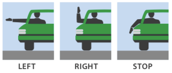
```

## 停车如何打方向盘

```{r, echo=FALSE, out.width='50%', fig.align='center', fig.cap="上下坡停车方向盘朝哪边打；图片出处：Wisconsin Motorists' Handbook"}
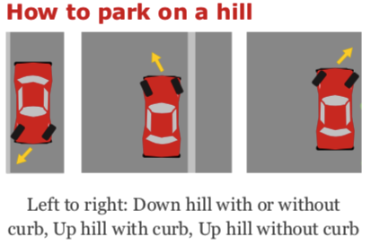
```

以下做法是为了防止你的车驶向车流。

- 停在路缘 (curb) 旁、面朝上坡，方向盘向左打死

- 面朝上坡但没有路缘，方向盘向右打死

- 面朝下坡，不管有没有路缘，方向盘向右打死

## 如何变道^[https://zutobi.com/us/driver-guides/how-to-change-lanes-driving]

1. 打转向灯

2. 看车内后视镜和左右两侧后视镜

3. 转身，视线越过左侧肩膀（如果你变道到左边）或右侧肩膀（如果你是变道到右边），看盲区内是否有车辆

4. 转向

5. 关闭转向灯

6. 提前做好准备，你就不必经常变道。尽量少变道。

## 如何左转

```{r, echo=FALSE, out.width='80%', fig.align='center', fig.cap="如何左转；图片出处：Wisconsin Motorists' Handbook"}
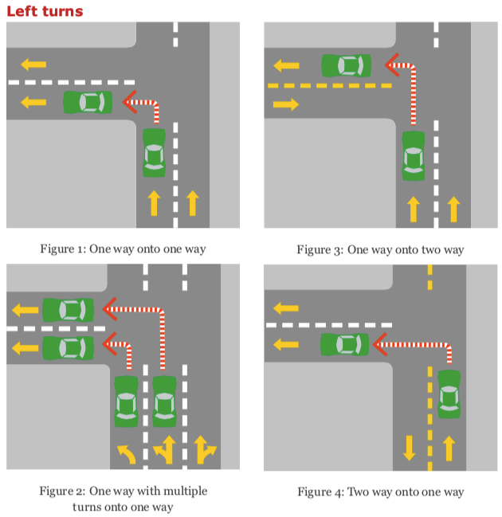
```

左转如果碰到红灯一般是不转的，有一种特殊情况是你从一条单向道左转进入另一条单向道。也就是上图的第一种情况。但这么做时，要先把车停下来，看看有没有过往车辆和行人，确认安全后再转。

## 道路交叉口的路权

- 如果没有任何路标和指示灯（无信号交叉口，uncontrolled intersection），你要给在你右侧的车辆让行。记得减速慢行

- 如果在一个十字路口，每个路口都有一个停车标 (Stop sign)，那么后来的车辆给先来的车辆让行。

## 撞上了野鹿 (deer) 怎么办？

- 检查你的车辆是否还能继续安全驾驶，如果不能，寻求帮助；

- 把你的车开到路边，不要阻塞交通；

- 记录下时间、地点和该事故的其他情况，之后保险公司会问到；

- 如果是你撞的，你有权带走这只鹿。如果你不要，你之后的车有权带走。不管谁想要，都必须跟 Sheriff’s Office 或者当地警察局 (local Police Department) 要一个专门的标签 (tag)。

- 如果你选择不带走这只鹿，你应当告知当地执法部门 (local law enforcement agency) 事发地点在哪里，特别是当这只鹿还没死时，你更应当报告。

## 爆胎 (blowout) 时怎么办

- 紧抓方向盘

- 不要转向，只向前开 (steer straight ahead)

- 脚慢慢移开汽车油门 (accelerator)

- 找一个安全的地方，驶离车道

注意⚠️：千万不要立马刹车，这样容易让轮胎抱死。等你掌控局面之后再缓缓刹车。

## 超车注意事项：

- 不许为了超车而超速；

- 一次只超一辆车；

- 尽量从左侧超车；

- 当有一辆车 a 在超你前方的车 b，不要追随 a。

## 如果有车辆在后面紧跟着你

- 不管它是不是有故意的，你可以变道到右侧车道。

- 如果你右侧没有车道，试着缓慢地把车速降下来。

请注意⚠️：不要加速，如果它是故意跟着你，你加速他还会跟着你。如果它不是恶意的，而只是为了逼你快走，你即使加速它还不会满足，还会嫌你走得慢，可能会继续跟着你。

## 当遇到轮胎打滑失控的情况时

- 让脚离开油门；

- 摆正方向盘；

请注意⚠️：不要马上踩刹车，等到轮胎正常后再刹车。

## 卡车盲区

```{r, echo=FALSE, out.width='45%', fig.align='center', fig.cap="卡车盲区；图片出处：Wisconsin Motorists' Handbook"}
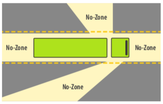
```

你并非永远不能进入卡车的盲区，这也不现实，因为你总要超车。但是要快进快出，注意安全。

```{r, echo=FALSE, out.width='50%', fig.align='center', fig.cap='卡车盲区范例；图片出处：driving-tests.org'}
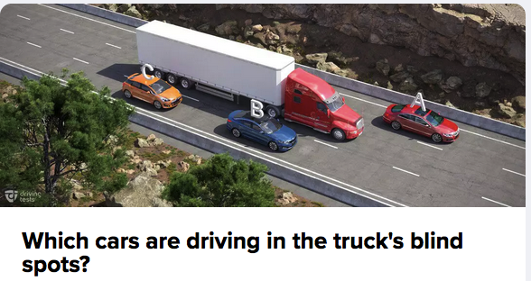
```

B 车在盲区

## 速度题

学校附近 + 有学生在行驶：15 mph

居民区、商业街道：25 mph

在湿滑路面 (wet road) 上，行驶速度不应超过 35 mph

城市边远地带：限速 35 mph

湿滑路面上，要减速 10 mph。雪上，减速一半。冰上，像乌龟一样爬行，赶紧找地方停下来。

车速 35 mph 或以上时，轮胎就可能打滑 (hydroplaning)。

## 距离题

当你看见校车的红灯在闪 (school bus with its red lights flashing)，不管你在相同车道还是对面车道，你都要停下来，并距离校车至少 20 feet。唯一的例外是，你在分隔公路 (divided highways or roadways) 上并且和校车不同方向。校车灯不闪之后，先看看路上是否还有学生，确认没有之后再开动。需要注意⚠️的是，有中央分隔带 (median seperation) 的才算是分隔公路 (divided roadways)，只用黄线分隔的，是非分隔公路 (undivided roadways)。

转向时，在距离转向处至少 100 feet 时亮灯示意

看见盲人，离 10 feet 远

平行停车 (parallel park) 时，距离路边 (curb) 至少 12 inch

当你的行驶速度是 50 mph 时， 400 feet 之内的人和物你无法及时停车躲闪。

不管行驶在城市内还是高速路上，都要注意前方 10-15 秒你所能行驶的范围 (look at least 10-15 seconds ahead)。如果你行驶在城市里，15 秒的行驶范围大概是1个城市街区，如果在高速路上，大概是4个城市街区。

行驶时，距离你前方的车辆最少 4 秒的距离

在多车道公路 (multi-lane road) 上，你应该行驶在右侧车道。超车时，用左侧车道。

行车速度为 55 mph 时，10 秒内你可以跑 800 feet。对面的车也是如此。因此，如果你要用对面车道 (the opposing lane) 来超车，你必须确保 1600 feet (大约为 1/3 mile) 内没有障碍物。

在上坡路停车，离前方停车的车辆至少一辆车的距离。

在威斯康星州，如果在铁轨旁停车，最少距离 25 feet （美国别的州一般要求 50 feet）。在人行道附近停车，至少距离 15 feet。在消防栓 (fire hydrant) 附近停车，至少距离 10 feet。

## 路标题

停车标 (Stop sign) 是八角形 (octagon)。只有它是八角形。看到此标，首先要停车。当行人和路上车辆清空时，你再前进。

竖立的长方形用来告标示限速、道路方向。

路标上有一辆自行车表示前方有自行车道通过。

高速路上这个不断闪烁的黄色 X 表示这条道只能用来转向 (the lane is only for turning)。如果是一个同样的标示但是没有闪烁，说明这条道的用途马上要变，你需要尽快离开这条道。

```{r, echo=FALSE, out.width='75%', fig.align='center', fig.cap='不断闪烁的黄色 X；图片出处：driving-tests.org'}
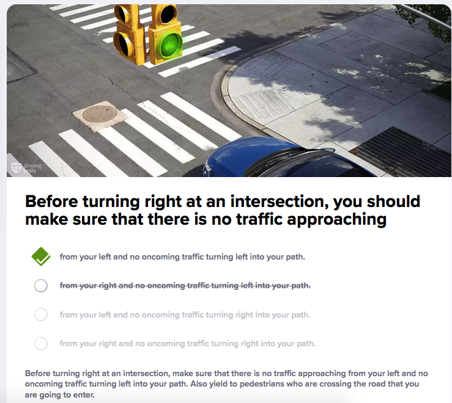
```

“Speed zone ahead” 提示你注意前方可能要减速至少 10 mph。

Yield 标不是说让你要停下来，而是让你慢行，注意来往车辆和行人。

### 道路交通线

行驶车道的最右侧用白色实线 (solid white line) 标示，过了它就是路肩 (shoulder)。行驶车道的左侧用黄色实线或者虚线标示。

多车道公路中的白线表示这些车道是相同方向的车道

  - 路中间的白色虚线：你可以变道，如果安全的话
  
```{r, echo=FALSE, out.width='50%', fig.align='center', fig.cap="路中间的白色虚线；图片出处：Wisconsin Motorists' Handbook"}
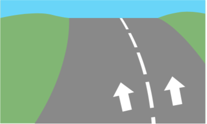
```

  - 路中间的白色实线：非特殊情况，你不能变道。特殊情况包括：躲避障碍物、下一个街区你就要转向
  
```{r, echo=FALSE, out.width='75%', fig.align='center', fig.cap='路中间的白色实线；图片出处：driving-tests.org'}
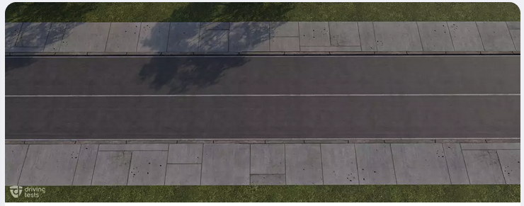
```

多车道公路中的黄色线表示这些车道是不同方向的车道

  - 两条黄色实线表示你不能变道，除非：1）你要转向驶向一个居民区小道 (driveway)；2）你要超车，但你只能超行驶速度比限速一半还要慢的车辆，需要注意的是，农业用车你不能超，因为它们本来就行驶地慢。第二条只是一个特例，在威斯康星可行，在别的州不一定能行。

```{r, echo=FALSE, out.width='50%', fig.align='center', fig.cap="两条黄色实线；图片出处：Wisconsin Motorists' Handbook"}
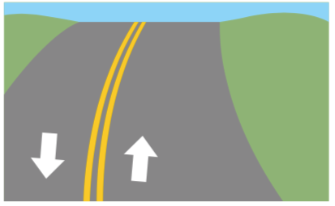
```
  - 一条黄色虚线表示你可以变道，但要注意驶来的车流，注意安全

  - 如果同时有黄色虚线和实线，当你所在车道是实线时，你不能变道，当你所在车道是虚线时，你可以变道超车。

```{r, echo=FALSE, out.width='50%', fig.align='center', fig.cap="同时有黄色虚线和实线；图片出处：Wisconsin Motorists' Handbook"}
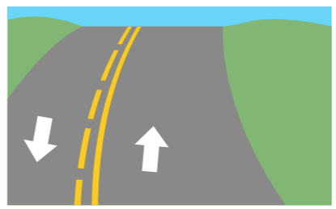
```

  - 如果有四条黄色实线，说明这是一个路障 (barrier)，不要左转或者掉头 (U-turn)，除非有特定出口

  - 如果路上有超过四条车道，那么两条黄色实线表示的是路的中央

  - 如果是一条双向道，中间有一条黄色实线，那么你不能越过它，除非你是要左转

```{r, echo=FALSE, out.width='75%', fig.align='center', fig.cap='双向道中间的黄色实线；图片出处：driving-tests.org'}
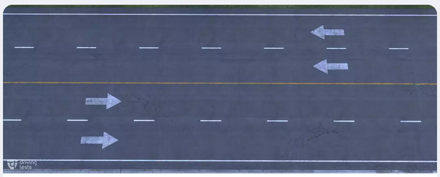
```

## 法规、违章与惩罚

### 酒

第一次被查到酒驾 (OWI: operating while intoxicated)：罚款、驾照吊销最少六个月。第二次被查到酒驾，后果非常严重：你的驾照会被吊销至少一年、你会进拘留所、你名下的车辆会被禁止使用。如果第三次或者更多次被查到酒驾，你的车会被没收，“酒驾”记录会在你的驾驶记录上保留 55 年。

喝少量的酒后，最少需要1- 2 个小时才能恢复清醒。如果喝得很多，则需要1-2天的时间来恢复正常。

仅仅喝一口酒就会影响到你安全驾驶。

40%-50% 的致命性车祸都和醉酒有关。

酒精含量 (alcohol concentration, AC) 每升高 0.02，发生致命性车祸 (fatal crash) 的概率翻一番 (double the risk)。

在威斯康星，21 岁以下绝对不许饮酒。若违反会被逮捕 (arrested)。

在威斯康星， 21 岁和以上的成年人，体内酒精含量 (AC, alcohol concentration) 不得超过 0.08.

连续驾车 18 小时相当于体内酒精含量 (alcohol content 或者 alcohol concentration, 简称 AC) 0.05. 连续 24 小时相当于 AC 0.1。Alcohol concentration 是官方名称。

普通车辆的车内，也就是司机和乘客能够得着的地方，不许方开盖的酒。

酒精 20-40 分钟之内可进入你的大脑。

酒精含量和发生交通事故概率升高的关系表：

```{r, echo=FALSE, out.width='50%', fig.align='center', fig.cap="酒精含量与发生交通事故概率升高之关系；图片出处：Wisconsin Motorists' Handbook"}
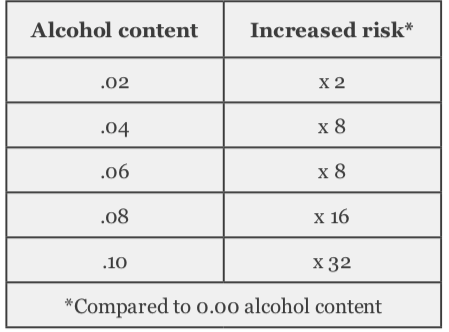
```

### 罚款

如果执法部门发现你没有上车险，你会面临最高 500 美元的罚款。如果你虽然上了车险，但执法部门检查时你无法拿出凭证，你会被罚款 10 美元，如果你撒谎或者提供假的保险资料，你面临最高 5000 美元的罚款。

如果违反 Move Over 或者 Slow Down Law，你会面临最高 300 美元的罚款。

如果警察认为你开车用用手机发短信有罪，你会面临最高 400 美元的罚款。

在施工区，如果你用手机，会罚款 20-40 美元，并记 4 分。

前座乘客没有系安全带：

  - 该乘客 8 岁以下：你会被罚款 10 美元

  - 该乘客在 16 岁以上：你和乘客都会被罚款 10 美元

如果你撞上了停在路边的车，车内无人，你要做的是写个条子，写上你的名字和住址（如果你并非所开之车的车主，写上车主的名字、姓名）、事发日期和具体时间。如果你没有这么做，会被罚款最高 200 美元。

### 违章记分、驾照暂停、吊销

如果任何 12 个月内你的违章记分超过 6 分，你会收到一封警告信 (warning letter)。如果任何 12 个月内你的违章记分超过 12 分，你的驾照将被暂停或吊销。

如果你的驾照被暂停 (suspended) 或者吊销 (revoked)，你或许可以申请临时驾照 ( occupational licence)，需要你提供财产证明来证明你能支付如果出事故后的费用。临时驾照规定你一天内最多开 12 个小时、一周内最多开 60 小时。

通过一期交通安全课程 (traffic safety course)，你的违章记分可以少 3 分。

如果警察要检查你是否饮酒或者吸毒但是你不配合，该警察必须要逮捕你，你的驾照将被吊销至少 1 年，并伴随其他限制。

### 其他

使用试用驾照期间，绝对不能在开车时用手机。

试用驾照期间如果违章，试用驾照将延期 6 个月。

孩童 4 岁之前必须用儿童安全座椅 (child safety seat)、4-8 岁要用加高座椅 (booster seat)。

如果五年内你有4次或以上重大违章 (major traffic violations) 或者12次及以上非重大违章 (minor violations), 车管所 (DMV) 会宣称你为惯犯 (habitual offender)。如果你是惯犯，你的驾照将被吊销 5 年，并且两年之内你无法申请临时驾照 (occupational licence). 

在威斯康星，上路意味着你默许 (implied consent): 当警察要看你是否酒驾或者吸毒时，你必须要配合。